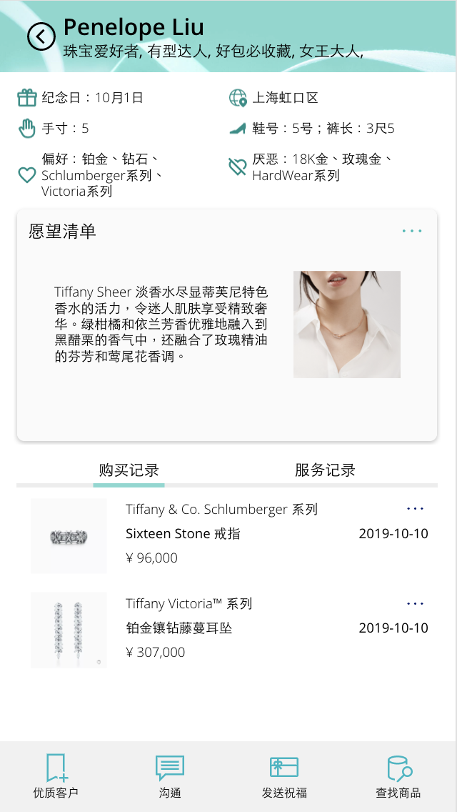
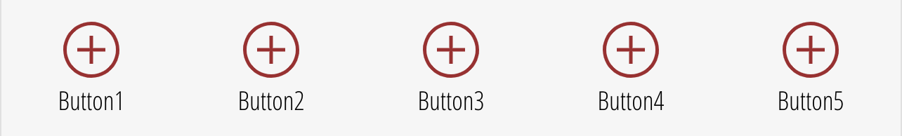
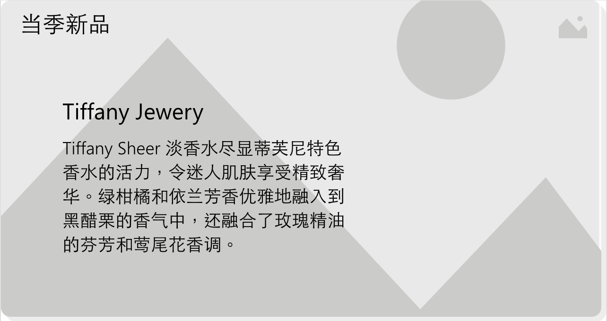

# PowerAppsDeveloperKits

Toolkits for Power Apps developers

## Components

Sample app made with these components

### TopBanner

### UserBottomPanel

### ImageButton

### Tab

### GeneralTopBanner

### GeneralBottomPanel

### TopPanelWithWaffle

### Card

### GeneralCard

### KPICard

### UserProfileCard

### TagList

### SearchBar

