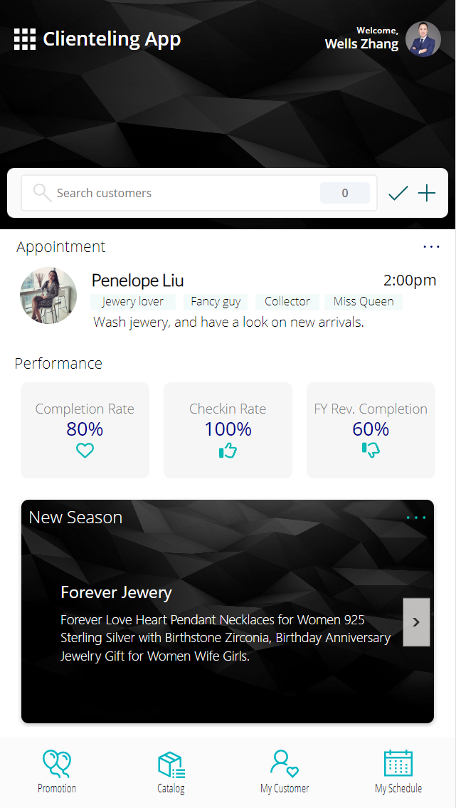
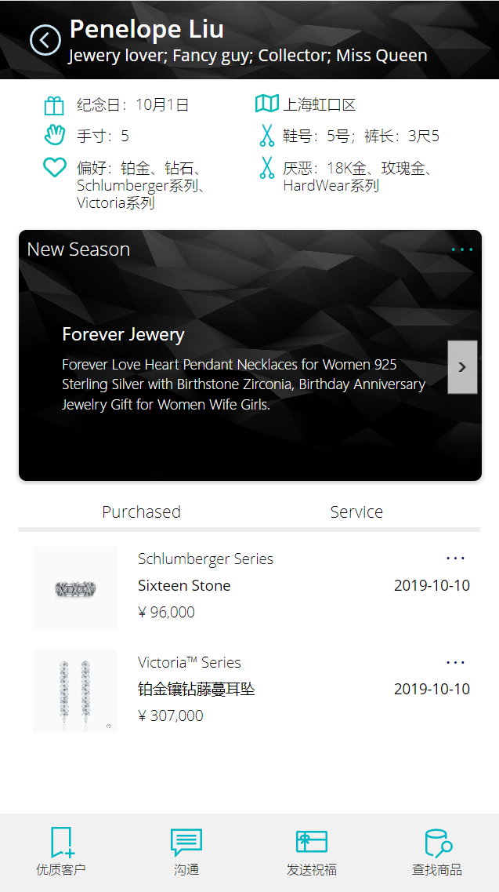
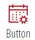
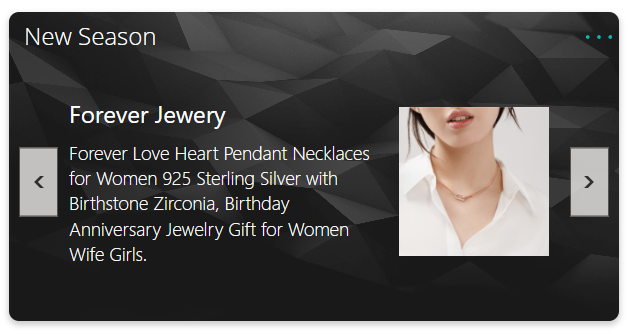
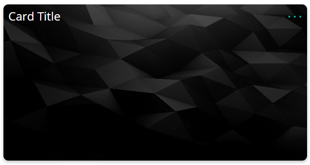
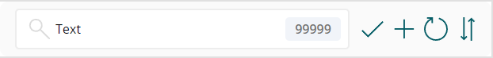

# Power Apps UI Components

## Component Library

Use components library to accelerate the speed of Power Apps development with high quality, by reusing the existing components assets and sharing with the team.

This component library is made for my daily POC projects, and you can use this as example or make your own library.

Hope this could be a good start point for you to quickly understand how components library can benefits your dialy low code development.

Components library includes:

- TopBanner
- UserBottomPanel
- ImageButton
- Tab
- GeneralTopBanner
- GeneralBottomPanel
- TopPanelWithWaffle
- Card
- GeneralCard
- KPICard
- UserProfileCard
- SearchBar

Sample app made with these components

**Home Screen**

**Detail Screen**

## Installation

- Download the solution in Release folder.
- Import solution into your environment.
- Use these componets in your solutions.

### TopBanner

### UserBottomPanel

### ImageButton

### Tab

### GeneralTopBanner

### GeneralBottomPanel

### TopPanelWithWaffle

### Card

### GeneralCard

### KPICard

#### Screen shot

#### Input properties

- Background Fill - Color
- KPI - Text
- KPI Color - Color
- KPI Font Size - Number
- KPI Font Weight - FontWeight
- Title - Text
- Subtitle - Text
- Title and Subtitle Font Size - Number
- Font Color - Color
- Subtitle Icon Image - Image
- Subtitle Icon Size - Number
- Show Icon Instead of Subtitle - Booleana
- Enable OnClick - Boolean

#### Behaviours

- OnClick - Boolean

#### Output properties

- N/A

### UserProfileCard

#### Screen shot

### SearchBar

#### Screen shot

#### Input propoerties

- Background Fill - Color
- Font Size - Number
- Font Weight - Text(Bold,SemiBold, Lighter)
- Search Hint - Text
- Button Color - Color
- Result Count - Number
- Show Search Result - Boolean
- Show Refresh Button - Boolean
- Show Add New Button - Boolean
- Show Sort Button - Boolean
- Show Searh Button - Boolean

#### Behaviors

- On Add New Clicked - Boolean
- On Refresh Clicked - Boolean
- On Search Clicked - Boolean

#### Output properties

- Srarch Text - Text
- Sort Order - SortOrder(Ascending/Descending)
